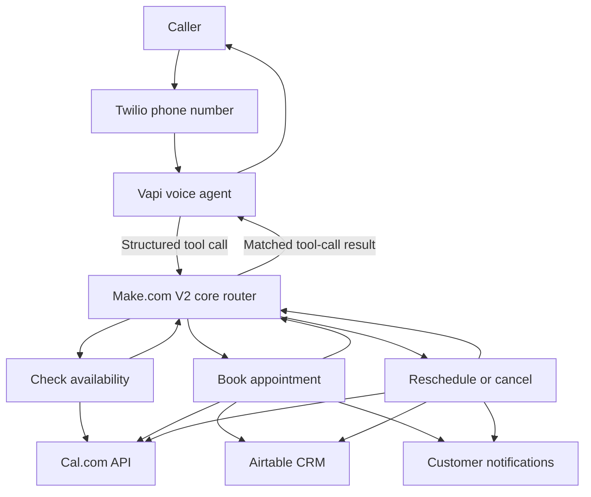

# AI Receptionist Automation Framework

**An appointment-management automation architecture for service businesses, demonstrated using a simulated physiotherapy clinic.**

> **Portfolio status:** This repository documents an existing Make.com prototype, the findings from a configuration audit, and an **in-progress V2 redesign**. It does **not** claim that the V2 workflow is deployed, fully tested, or currently handling live clinic calls. Example customer data is synthetic.

## What it does

A voice AI receptionist can handle four appointment workflows: **check availability, create a booking, reschedule a booking, and cancel a booking**. The design integrates a telephony layer (Twilio), conversational voice AI (Vapi), workflow orchestration (Make.com), calendar booking (Cal.com), a CRM (Airtable), and customer notifications (Outlook).

## Project status

| Component | Status |
|---|---|
| Legacy Make.com AI Receptionist | Existing prototype; inactive |
| Legacy workflow module-by-module review | Completed; issues documented |
| V2 Make folder and scenario scaffolds | Created; inactive and not implemented end-to-end |
| V2 telephony / Vapi connection | Requires setup and live testing |
| Cal.com / Airtable integrations | Designed; require verification in V2 |
| End-to-end voice-call tests | Not yet completed |

**Do not use the V2 scaffolds for real appointments until the acceptance tests pass.**

## Documentation

- [System architecture](architecture/system-architecture.md)
- [Call and data flow](architecture/data-flow.md)
- [Error-handling strategy](architecture/error-handling.md)
- [Make scenario inventory](make/scenario-overview.md)
- [Availability logic](make/check-availability.md)
- [Booking](make/booking.md)
- [Manage booking](make/manage-booking.md)
- [Notifications](make/notifications.md)
- [Vapi assistant and prompt design](vapi/assistant-design.md)
- [Vapi tool interface](vapi/tool-schema.md)
- [Cal.com booking model](calcom/booking-model.md)
- [Airtable schema](crm/airtable-schema.md)
- [Legacy configuration audit](docs/current-state-audit.md)
- [V2 improvements](docs/v2-improvements.md)
- [Implementation guide](docs/implementation-guide.md)
- [Testing plan](docs/testing-plan.md)
- [Interview walkthrough](docs/interview-walkthrough.md)

## Engineering principles

1. **Cal.com is the scheduling source of truth.** A slot is available only when the scheduling API confirms it.
2. **Identify appointments by unique booking UID**, never only by customer name.
3. **Do not announce success before the booking API confirms it.**
4. **Avoid hard-coded dates** and use timezone-aware timestamps for Australia/Melbourne.
5. **Treat CRM and email as follow-up operations** that may fail independently; retry and reconcile them.
6. **Validate inbound tool requests and authenticate the webhook.**
7. **Minimise patient data.** Do not record clinical details, secrets, call audio or real patient information in this public repo.

## Technology

Twilio · Vapi · Make.com · Cal.com · Airtable · Outlook · OpenAI (where appropriate)

## Interview summary

> I designed and iterated on an AI receptionist orchestration system for appointment-based businesses. The original Make.com prototype integrated voice-agent tool calls with calendar bookings, CRM records, and email notifications. I audited its reliability risks—including booking identification, availability verification, API-version mismatches, and error handling—and designed a modular V2 approach with deterministic scheduling checks and booking-UID-based operations.

## License / privacy

Documentation and examples are shared for educational and portfolio purposes. Configure your own credentials in the relevant providers, never in source control. Use only test numbers, test accounts, and synthetic data until the integration is validated.
