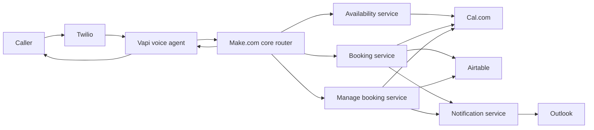

# System Architecture

## Objective

Provide a reliable conversational front door for an appointment-based business while keeping scheduling actions deterministic and auditable.

## Logical architecture

## Responsibilities

- **Twilio:** phone number and telephony transport.
- **Vapi:** speech, conversation state, tool selection, and spoken responses.
- **Make.com:** orchestration, validation, routing, API calls, error handling, and audit flow.
- **Cal.com:** authoritative appointment calendar.
- **Airtable:** lightweight CRM / appointment mirror.
- **Outlook:** customer confirmations.
- **OpenAI:** optional language/date reasoning only where deterministic logic is insufficient.

## Boundary rules

- Voice AI never directly mutates the calendar.
- CRM is not used to determine real-time availability.
- Booking UID is the canonical cross-system appointment identifier.
- V2 should use one timezone consistently: `Australia/Melbourne`.
